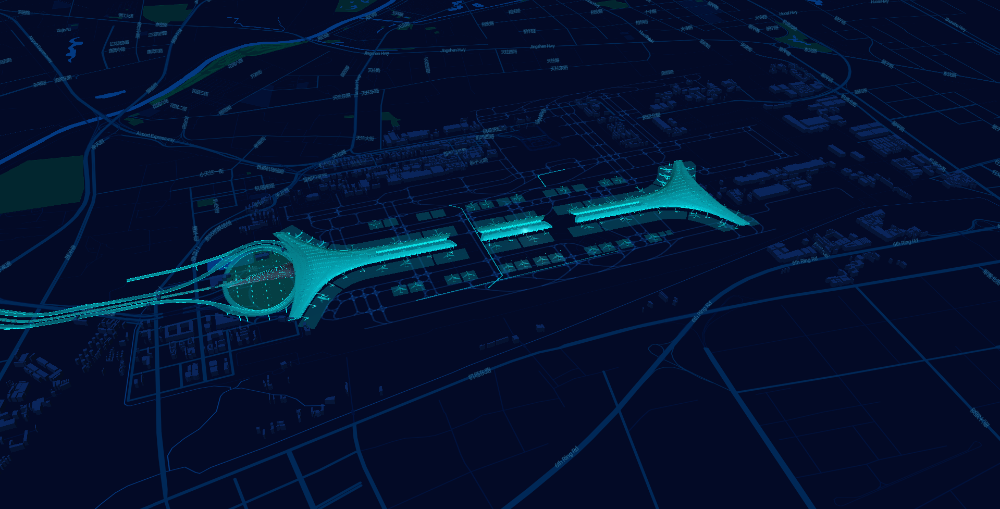

# <p align = "center"> 基于 Mapbox+deckGl 的路线可视化方案</p>

## 项目说明

1. mapbox token 已失效，需要自行使用可用 token
2. 本项目创建于 2018 年，依赖已产生问题
3. map.vue 提供加载地图，加载模型，加载 layer，渲染动画的展示方案
4. 项目加载 gltf 使用了加密解密算法，可有效将模型从 200M=>1M，为商用提供了可能性

## 运行方式

```
npm install

npm run dev
```

## 技术栈

[mapbox](https://www.mapbox.com/)，[deck.gl](https://deck.gl/#/)

[threejs](https://threejs.org/)，[threejs](https://threejs.org/)

[obj2gltf](https://github.com/AnalyticalGraphicsInc/obj2gltf)，[gltf-pipeline](https://github.com/AnalyticalGraphicsInc/gltf-pipeline)，[draco](https://google.github.io/draco/)

感谢以上开源库的帮助

## 效果展示


